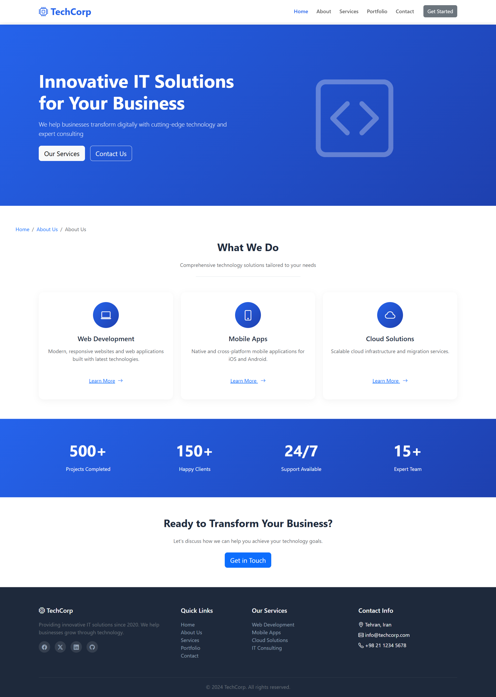
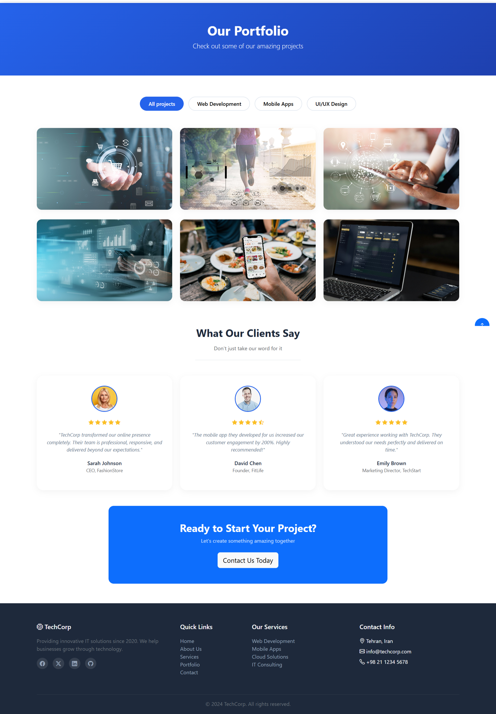

# TechCorp · Corporate Website

A fully responsive, 5‑page corporate website built with Bootstrap 5 as a practice project to demonstrate front‑end development skills.

---

## 🚀 Live Demo

👉 [View the live website](https://emoatari.github.io/corporate-website)

---

## 📖 About The Project

This project is a complete business website for a fictional tech company called "TechCorp". It was built from scratch to practice and showcase skills in:

- Building multi‑page websites with a consistent layout
- Using Bootstrap 5 for responsive design and UI components
- Implementing interactive elements with vanilla JavaScript
- Structuring clean, maintainable HTML and CSS

The site includes 5 main pages:
- **Home** – Hero section, services preview, stats, and CTA
- **About** – Company story, mission, team members, and expertise
- **Services** – Detailed service cards with pricing tables
- **Portfolio** – Filterable project gallery with modal details
- **Contact** – Contact form, info cards, FAQ accordion, and map placeholder

---

## 🛠️ Technologies Used

| Technology | Usage |
| :--- | :--- |
| **HTML5** | Page structure and semantic markup |
| **CSS3** | Custom styling and animations |
| **Bootstrap 5.3** | Grid system, components, and responsiveness |
| **Bootstrap Icons** | Icon library for UI elements |
| **JavaScript** | Interactive features (filter, modal, FAQ toggle, toast notifications) |

---

## ✨ Key Features

- ✅ Fully responsive design (mobile‑first approach)
- ✅ Sticky navigation bar with active link highlighting
- ✅ Portfolio filtering by category (All / Web / Mobile / Design)
- ✅ Project detail modal with dynamic content
- ✅ FAQ accordion with toggle functionality
- ✅ Contact form with client‑side validation and success toast
- ✅ Back‑to‑top button for better UX
- ✅ Clean, modern, and professional visual identity

---

## 📂 Project Structure

```plaintext
corporate-website/
├── index.html
├── about.html
├── services.html
├── portfolio.html
├── contact.html
├── assets/
│   ├── css/
│   │   └── bootstrap.min.css
│   ├── js/
│   │   └── bootstrap.bundle.min.js
|   |   └── script.js
│   └── imgs/
│       └── (project images)
└── README.md
```

---

## 🧪 How to Run Locally

1. Clone the repository:
   git clone https://github.com/emoatari/corporate-website.git
2. Navigate to the project folder:
   cd corporate-website
3. Open index.html in your browser.
4. That's it! No build tools or dependencies required.

---

📸 Screenshots



---

🤝 Contributing
This is a practice project, but if you have suggestions or find bugs, feel free to open an issue or submit a pull request.

---

## 📫 Let's Connect

- 💼 [LinkedIn](https://linkedin.com/in/ehsan-moattari)
- 🐙 [GitHub](https://github.com/emoatari)
- 📧 [moattariehsan@gmail.com](mailto:moattariehsan@gmail.com)
- 🌐 [Portfolio](https://emoatari.github.io)

---

📄 License
Free to use for personal and commercial projects. Attribution is appreciated but not required.
